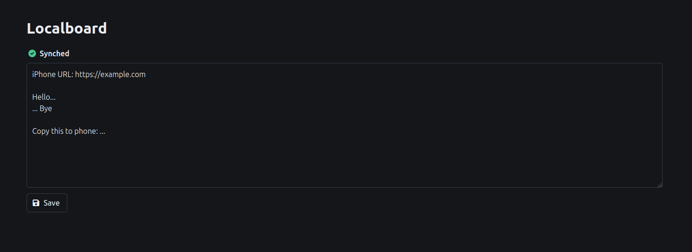

# Localboard

Simple textbox to share text.

I needed a very simple way to share text between several devices. All I needed was a textbox. Kinda like a clipboard on your local network?



## Usage

- The main idea is to host this on some device on your local network (this simple [docker-compose](./docker-compose.yml) might help).
- The textbox data is simply saved on a text file on the server.

Build:
```bash
make build
```

Run:
```bash
./bin/localboard
```
